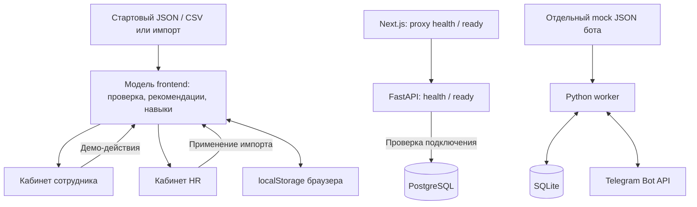

# Career Quest

**Навигатор профессионального развития сотрудников** для HackAlem AI, трек Halyk Bank, кейс Career Quest.

Проект помогает сотруднику выбрать следующий шаг развития и увидеть его связь с карьерной целью, а HR — понять, какие компетенции требуют поддержки и кто давно не участвовал в добровольных активностях.

**Статус:** работающее веб-демо на синтетическом датасете, отдельный каркас backend и прототип Telegram-бота. Веб-рекомендации рассчитываются локальным многофакторным алгоритмом. **LLM, серверная авторизация и общая база пользовательского прогресса пока не подключены.**

## 1. Проблема и пользователи

Обучение, менторство и другие HR-события часто приходят сотруднику разрозненно: непонятно, зачем участвовать и как это приблизит его к следующей роли или грейду. HR при этом сложно увидеть общую картину потребностей в развитии.

Career Quest объединяет профиль, требования карьерной цели, историю участия и каталог мероприятий в одном интерфейсе:

- **Сотрудник** получает объяснимые рекомендации, собирает план и видит изменение навыков.
- **HR** видит срез команды, разрывы компетенций и длительные паузы в развитии.

Покрытие карьерной цели — ориентир для развития, а не оценка результативности или автоматическое решение о повышении.

## 2. Что реализовано

### Кабинет сотрудника — `/`

- Выбор синтетического демо-профиля, отображение роли, текущего грейда и карьерной цели.
- До трёх подходящих мероприятий с объяснением: разрыв навыков, критичность для цели, история похожих активностей, доступность и длительность.
- Каталог с поиском по названию или навыку и фильтром формата; причины недоступности видны до записи.
- Личный план: добавление, отмена добровольного участия и подтверждаемое **демо-завершение**.
- Карта навыков и история, включая завершения, пропуски, отказы и просрочки.
- Пересчёт навыков и рекомендаций после завершения; сохранение изменений в браузере.

### Кабинет HR — `/hr`

- Обзор команды: количество сотрудников, среднее покрытие личных целей, завершения за 30 дней и паузы от 60 дней.
- Поиск сотрудников по имени, ID и роли, фильтры, пагинация и переход к профилю сотрудника.
- Срез дефицита компетенций относительно карьерных целей, в том числе по подразделению.
- CSV-экспорт отфильтрованного списка сотрудников.
- Импорт JSON/CSV с проверкой и предпросмотром, включая дополнительные профили и историю для проверки жюри.
- Экспорт полной резервной копии JSON, её восстановление и возврат к стартовому датасету.

Оба кабинета используют единое состояние на одном origin браузера. Интерфейс адаптирован для мобильного и настольного экрана, использует локальные шрифты Manrope и логотип Halyk. Старый маршрут `/hr/insights` перенаправляет в раздел данных HR.

### Отдельные компоненты

- **FastAPI:** endpoints состояния сервиса и подключения к PostgreSQL, доменные модели, функция расчёта прироста навыков, интерфейсы будущего ранжирования и объяснений. Полный бизнес-API ещё не реализован.
- **Telegram-бот:** напоминания о длительном отсутствии участия, приближающемся дедлайне и просрочке; команды управления подпиской; хранение привязок и доставки в SQLite. Он работает с отдельным mock JSON и **не синхронизирован с веб-кабинетами**.

## 3. Как работает решение

1. Браузер загружает стартовые профили, мероприятия, навыки и историю либо ранее сохранённое состояние.
2. Для сотрудника определяется заданная карьерная цель. Если её нет, используется следующий грейд той же роли; для Lead остаётся Lead.
3. Рассчитываются текущие навыки и разрывы с требованиями цели.
4. Алгоритм отбирает доступные добровольные мероприятия и ранжирует их по нескольким факторам.
5. Сотрудник видит до трёх шагов, ожидаемый прирост и объяснение выбора, затем добавляет мероприятие в план.
6. После подтверждения демо-завершения изменяются история, навыки, покрытие цели и HR-срез. Повторное завершение той же записи отклоняется.

### Логика рекомендаций и прогресса

Реализация находится в [model.ts](apps/web/src/app/career/model.ts).

- Учитываются требования цели, критичные навыки, ожидаемое закрытие разрыва, завершения и пропуски похожих активностей, а также длительность мероприятия.
- Перед ранжированием проверяются роль, грейд, начальные требования, наличие будущих сессий и история участия. Обязательные мероприятия не рекомендуются.
- Завершённое мероприятие повторно не предлагается; исключение датасета — регулярный клуб `EV_036`, с ограничением повторения на дату сценария.
- Навыки в профиле — снимок на `last_review_date`. К нему добавляются завершения после этой даты и результаты демо. Отсутствующий навык считается равным 0.
- Для каждого эффекта: `новый уровень = max(текущий, min(текущий + gain, max_level, 5))`. Уже достигнутый уровень не снижается.
- Покрытие цели: `round(100 × сумма min(текущий уровень, требуемый уровень) / сумма требуемых уровней)` по навыкам целевой роли. Если сумма требований равна 0, покрытие равно 100%.

Объяснения формируются из рассчитанных фактов по шаблонам. Обученной AI-модели или вызовов LLM в текущем сценарии нет. Отказы и отсутствие участия сами по себе не уменьшают навыки; публичного рейтинга сотрудников нет.

## 4. Технологии

| Компонент | Подтверждённые технологии | Применение |
| --- | --- | --- |
| Веб-интерфейс | TypeScript, React 19.2.3, Next.js 16.3.6 | Кабинеты и маршрутизация; расчёт демо в браузере |
| Стили | CSS, Tailwind CSS 4.3.3 / PostCSS в конфигурации, локальные Manrope и SVG | Основной интерфейс оформлен собственным `career.css` |
| Состояние веб-демо | Browser localStorage, JSON, CSV | Сохранение, импорт, экспорт и обновление между вкладками |
| Backend-каркас | Python, FastAPI 0.115.12, Pydantic 2, Uvicorn | Системные endpoints и доменные контракты |
| Хранилище backend | PostgreSQL 17, SQLAlchemy 2, psycopg 3, Alembic | Подключение и проверка БД; бизнес-таблицы ещё не созданы |
| Бот | Python 3.11+, стандартная библиотека, SQLite, Telegram Bot API | Отдельный worker с long polling и напоминаниями |
| Проверки | Node.js test runner, TypeScript, pytest, unittest | Тесты модели frontend, каркаса API и бота |
| Инфраструктура | Docker, Docker Compose | Конфигурация `db`, `api`, `web`; у бота отдельный Dockerfile |
| AI-модели | Не подключены | В `.env.example` API есть резервная переменная `OPENAI_API_KEY`, текущему демо она не нужна |

Зависимости: [frontend](apps/web/package.json), [backend](apps/api/requirements.txt), [backend для разработки](apps/api/requirements-dev.txt).

## 5. Архитектура проекта



Бизнес-сценарий веб-демо выполняется в браузере и не обращается к FastAPI. Next.js проксирует только `/api/v1/health` и `/api/v1/ready`. Backend и бот — самостоятельные компоненты; стрелки синхронизации их бизнес-данных с frontend пока отсутствуют.

```text
apps/
  web/
    src/app/career/       UI, рекомендации, импорт, работа с localStorage
    src/app/page.tsx      Кабинет сотрудника
    src/app/hr/           Кабинет HR
    src/app/api/v1/       Proxy системных endpoints
    public/demo-data/    Датасет, загружаемый браузером
    public/brand/        Логотип и шрифты
    tests/               Тесты frontend-модели
  api/
    app/api/             HTTP endpoints
    app/domain/          Доменные модели и прирост навыков
    app/application/     Интерфейсы ранжирования и объяснений
    app/infrastructure/  Подключение к PostgreSQL
    app/auth/            Перечисление ролей, без реализации входа
    migrations/          Конфигурация Alembic; revisions отсутствуют
    tests/               Тесты каркаса
  bot/
    career_bot/          CLI, правила, сценарии и адаптеры
    tests/               Тесты с временной SQLite и fake sender
dataset/                 Исходный набор и описание схемы на ru / kk / en
docs/                    Архитектура, планы и отчёты проверок
compose.yaml             Конфигурация контейнеров
```

## 6. Установка и запуск

### Рекомендуемый путь для жюри: веб-демо без backend

Нужны Git, npm и Node.js, соответствующий `engines` в `apps/web/package.json`: `^22.13.0 || ^24.3.0 || >=25.0.0`. В `.nvmrc` указана ветка 22. Docker, Python, API-ключи и Telegram для веб-демо не требуются.

```sh
git clone --branch Asanali https://github.com/BAITC-Hacks/hack-1e16bce7-daniyal.git
cd hack-1e16bce7-daniyal
npm --prefix apps/web ci
npm --prefix apps/web run dev -- --port 3100
```

Если репозиторий уже скачан, выполняйте последние две команды из его корня. После установки зависимостей демо запускается одной командой `npm --prefix apps/web run dev -- --port 3100`.

- [Кабинет сотрудника](http://localhost:3100/)
- [Кабинет HR](http://localhost:3100/hr)

Для локальной production-сборки остановите dev-сервер и выполните:

```sh
npm --prefix apps/web run build
npm --prefix apps/web run start -- --port 3100
```

### Дополнительно: backend-каркас и PostgreSQL

Для проверки API нужен запущенный Docker Desktop / Docker Engine с Compose. Из корня, при первоначальной настройке:

```sh
cp .env.example .env
docker compose up --build -d --wait db api
```

В PowerShell вместо `cp` используйте `Copy-Item .env.example .env`. Существующий настроенный `.env` не перезаписывайте.

| Адрес | Назначение |
| --- | --- |
| [localhost:8000/docs](http://localhost:8000/docs) | OpenAPI / Swagger UI |
| [localhost:8000/api/v1/health](http://localhost:8000/api/v1/health) | Проверка процесса API |
| [localhost:8000/api/v1/ready](http://localhost:8000/api/v1/ready) | Проверка подключения к PostgreSQL |
| `127.0.0.1:55432` | PostgreSQL; порт задаётся `POSTGRES_PORT` |

По умолчанию web-proxy обращается к `http://127.0.0.1:8000`. Для другого адреса скопируйте `apps/web/.env.example` в `apps/web/.env.local`, задайте `API_URL` и перезапустите frontend.

База сохраняется в Docker volume `postgres_data`. `docker compose down` останавливает контейнеры без удаления volume. Учётные данные из `.env.example` предназначены только для локальной разработки.

В `compose.yaml` также описан сервис `web`, но текущая runtime-стадия его Dockerfile не копирует каталог `public/` с датасетом, логотипом и шрифтами. Поэтому для воспроизводимого показа интерфейса используйте npm-запуск выше; запуск всех сервисов Compose пока не заменяет его без исправления упаковки web-образа.

### Дополнительно: Telegram-бот без отправки сообщений

Нужен Python 3.11+. Из корня:

```sh
cd apps/bot
python -m career_bot init-demo
python -m career_bot preview
```

`init-demo` создаёт `data/employees.json` и не перезаписывает существующий файл. `preview` показывает будущие напоминания без токена и сетевых обращений к Telegram. Для повторного просмотра достаточно второй команды.

Для реальной отправки требуются свой бот, локальные `TELEGRAM_BOT_TOKEN` и `TELEGRAM_BOT_USERNAME`, запуск worker и подключение сотрудника по одноразовой ссылке. Команды и настройка описаны в [README бота](apps/bot/README.md). Бот не запускается автоматически вместе с основным Compose.

## 7. Как проверить решение

### Сценарий для жюри

1. Откройте [HR](http://localhost:3100/hr) → **Данные**. Если ранее меняли демо, сохраните резервную копию и подтвердите восстановление исходного набора.
2. Откройте [кабинет сотрудника](http://localhost:3100/). Через **Сменить демо-профиль** выберите **E0002 — Arman Zhaksylykov**, Backend Engineer, Middle.
3. Раскройте **Почему это подходит мне** у рекомендации **System Design Fundamentals**. В исходном сценарии алгоритм учитывает требования Senior, критичность навыков и историю участия.
4. Добавьте мероприятие в план, откройте **Мой план**, нажмите **Завершить в демо** и подтвердите действие.
5. Откройте **Навыки и история**. В проверенном исходном сценарии System Design и API Design меняются с **1 до 2**, покрытие цели — с **62% до 66%**; появляется запись о демо-завершении.
6. Перейдите в **HR → Сотрудники**, найдите `E0002`. Значение покрытия цели должно совпадать с кабинетом сотрудника. Перезагрузите страницу: при доступном localStorage результат сохраняется.
7. Для проверки импорта в **HR → Данные** выберите файлы JSON профилей и CSV истории в схеме датасета. Нажмите **Проверить файлы**, ознакомьтесь с предпросмотром и нажмите **Применить импорт**. Дополнительный профиль появится в обоих кабинетах.
8. Проверьте поиск без совпадений, экспорт CSV и скачивание резервной копии. Загрузка резервной копии явно показывает режим полной замены и требует отдельного подтверждающего действия.

При изменённом датасете рекомендации и проценты могут отличаться. Демо-завершение моделируется на дату сценария, даже если реальная сессия мероприятия назначена позже.

### Автоматические проверки

Из корня проекта после установки frontend-зависимостей:

```sh
npm --prefix apps/web test
npm --prefix apps/web run typecheck
npm --prefix apps/web run build
```

Тесты frontend проверяют все 200 профилей, правила прироста, учёт даты оценки, защиту от повторного завершения, отмену без начисления, импорт проверочного профиля, невалидные данные и приоритет критичного навыка перед минимальным нерелевантным.

Тесты бота без реальных отправок:

```sh
cd apps/bot
python -m unittest discover -s tests -v
```

Тесты backend из корня, с Python 3.11+ и отдельным виртуальным окружением:

```sh
python -m venv .venv
.venv/bin/python -m pip install -r apps/api/requirements-dev.txt
.venv/bin/python -m pytest -c apps/api/pytest.ini apps/api/tests -q
```

В Windows замените `.venv/bin/python` на `.venv\Scripts\python.exe`. Проверки readiness в этих тестах используют подменённое подключение; они не заменяют проверку работающей PostgreSQL.

Сохранённые результаты браузерных проверок и прогона frontend: [frontend-verification.md](docs/frontend-verification.md). Более ранняя история проверок каркаса: [verification.md](docs/verification.md).

## 8. Данные и интеграции

Используется синтетический стартовый набор Career Quest. Реальные персональные данные для демонстрации не нужны.

| Файл | Содержимое |
| --- | --- |
| `employees.json` | 200 профилей сотрудников |
| `events.json` | 40 мероприятий |
| `skills.json` | 60 навыков, требования для 8 ролей × 4 грейдов |
| `activity_history.csv` | 2 743 записи участия за 24 месяца |

**Дата среза:** `2026-10-01`. **Период истории:** `2024-10-01` — `2026-09-30`. Веб-демо использует эту фиксированную дату, а бот формирует свой mock-набор относительно времени запуска.

Исходники находятся в [dataset](dataset), браузерная копия — в [public/demo-data](apps/web/public/demo-data). Схема и правила: [русский](dataset/README.ru.md), [казахский](dataset/README.kz.md), [английский](dataset/README.md). Это переводы документации датасета; интерфейс и содержимое мероприятий полностью на три языка не переведены.

### Импорт

- Поддерживаются JSON-объекты с массивами `employees`, `events`, `skills` и `role_profiles`, а также CSV истории с десятью столбцами исходной схемы. Примеры — соответствующие файлы датасета.
- Можно загрузить только дополнительные профили и их историю. Они должны ссылаться на существующие роли, навыки и мероприятия либо загружаться вместе с необходимыми справочниками.
- По умолчанию записи объединяются и обновляются по ID. Режим замены меняет выбранные части набора; весь результат проверяется до применения.
- Для обычного импорта дата `meta.as_of_date`, если передана, должна совпадать с текущей датой среза. Файлы размером от 10 000 000 байт отклоняются.
- Полная резервная копия JSON восстанавливается целиком с явным предупреждением. Это другой сценарий, чем объединение отдельных файлов.
- Импорт читается в браузере и не отправляется на backend или во внешний AI-сервис.

### Внешние сервисы и настройки

| Настройка / сервис | Где используется |
| --- | --- |
| `API_URL` | Серверный proxy Next.js для health / ready; по умолчанию localhost:8000 |
| `DATABASE_URL`, `POSTGRES_*` | Подключение backend и настройка PostgreSQL |
| Telegram Bot API | Только отдельный worker при реальном запуске бота |
| `TELEGRAM_BOT_TOKEN`, `TELEGRAM_BOT_USERNAME` | Локальная конфигурация бота, не frontend |
| `CAREER_QUEST_URL` | Необязательная HTTPS-ссылка в сообщениях бота |
| `INACTIVE_DAYS` | Порог неактивности бота, по умолчанию 14 дней; отличается от 60 дней в HR-срезе |
| `OPENAI_API_KEY` | Зарезервирован в примере конфигурации API; рабочий адаптер отсутствует |

Halyk используется как визуальный ориентир проекта. Интеграции с банковскими API в коде нет. Настоящие токены храните в локальных `.env`, а не в README или Git.

## 9. Ограничения текущей версии

- **AI-слой не завершён:** рекомендации и объяснения формируются правилами в браузере, не LLM. Качество модели на закрытых профилях жюри не заявляется.
- **Нет настоящего входа и разграничения прав:** выбор сотрудника и переключатель HR — демонстрационные элементы. Реальные HR-данные сюда загружать нельзя.
- **Прогресс хранится локально:** другой браузер, устройство, порт или hostname имеют отдельное состояние. Общей серверной БД прогресса и разрешения конфликтов одновременных правок нет.
- **Завершение моделируется:** нет подключения к LMS, подтверждения посещаемости или аттестации. Процент покрытия не гарантирует повышение.
- **Backend — каркас:** отсутствуют бизнес-endpoints для профилей, рекомендаций и выполнения активностей; бизнес-таблицы и миграции ещё не созданы.
- **Уведомления отделены от веб-демо:** бот использует собственную схему и SQLite. Один worker на одного бота; при неоднозначном сетевом сбое возможен повтор отправки.
- **Halyk SuperApp не подключён:** нет SSO, WebView bridge и банковских интеграций. Это веб-прототип, не нативное мобильное приложение.
- **Локализация частичная:** интерфейс преимущественно русский, названия и описания из датасета — английские.
- **Docker-упаковка frontend требует исправления:** runtime-образ не содержит `public/`; рекомендованный способ показа — запуск через npm.
- **Пределы проверки:** SLA отклика и нагрузка не измерены; физические телефоны, screen reader и работа внутри SuperApp не проверены. Уменьшенная ширина браузера не заменяет испытание на устройстве.

## 10. Развёрнутая версия

**Подтверждённая публичная deployed-ссылка в репозитории не указана.** Адреса `localhost` выше предназначены для локального запуска и не являются публичным деплоем.

Для демонстрации жюри используйте инструкцию npm-запуска из раздела 6. Наличие Dockerfile и Compose означает наличие конфигурации, а не подтверждение промышленного развёртывания.
