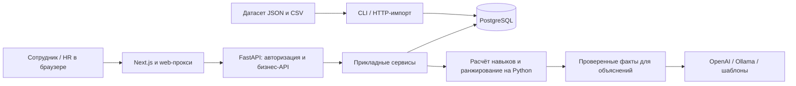

# Career Quest

AI-навигатор развития сотрудников для HackAlem AI, трек Halyk Bank.

Career Quest помогает сотруднику понять, каких навыков не хватает для карьерной
цели и какие обучения помогут их развить. HR получает обзор готовности сотрудников,
дефицита навыков и участия в обучении. Решение связывает профиль, требования
к грейду и каталог мероприятий в персональный план развития.

## Что реализовано

React + Next.js + Tailwind для мобильного и настольного браузера, FastAPI,
PostgreSQL + SQLAlchemy, Alembic и Docker Compose.

- `/` — обзор профиля сотрудника; `/career` — карьерная траектория и навыки;
  `/recommendations` — рекомендации; `/activities` — каталог активностей
  и завершение с результатом; `/history` — история участия.
- `/hr` — экраны KPI, gaps, статистики активностей, сотрудников с поиском/фильтрами,
  просмотра профиля и загрузки исходного/добавочного датасета.
- `/ai-recommendations` — отдельный подбор обучения из PostgreSQL с объяснениями
  Qwen3/Ollama или OpenAI и fallback на трёх языках. Доступен после демо-входа:
  сотруднику — свой профиль, HR — список сотрудников.
- Demo-вход, HttpOnly-сессия, allowlist web-прокси; загрузка, пустые состояния,
  ошибки и повтор запросов. В браузере нет расчётов scoring/readiness или локальной БД.
- Доменные модели, расчёт роста навыков и автономный AI-слой: gaps/readiness,
  рекомендации, OpenAI-объяснения и fallback на трёх языках.

Бизнес-таблицы, первая миграция и транзакционный CLI-импорт датасета реализованы.
**Фронтенд подключён к backend API и PostgreSQL.**
На странице входа выберите «Сотрудник» и профиль (например E0001), либо «HR»
и введите `DEMO_HR_PASSWORD` из локального `.env`. Каталог, список HR, HTTP-импорт
и завершение подключены к реальной БД. Траектория, рекомендации и HR-аналитика
рассчитываются на backend по данным из той же БД. Mock-данные не подставляются.
Контракт и тестовый режим: [Frontend API](docs/frontend-api.md).

Telegram-бот: [запуск и команды](apps/bot/README.md). Отдельный mock JSON, напоминания
о дедлайнах, просрочках и отсутствии участия. Токен нужен только для реальной отправки.

## Backend: новые сценарии

Реализованы список сотрудников HR, каталог активностей, HTTP initial/append импорт
и транзакционное завершение с защитой от повторного начисления.
Контракты, миграция и правила демо-симуляции: [backend-workflows](docs/backend-workflows.md).
Траектория, рекомендации и HR-метрики рассчитываются доменной логикой;
см. [career-workspace](docs/career-workspace.md).

## Как работает решение

1. HR загружает датасет с сотрудниками, навыками, требованиями и мероприятиями.
2. Сотрудник входит в свой демо-профиль и видит текущие навыки, карьерную цель
   и готовность к целевому грейду.
3. Backend сравнивает навыки с требованиями и подбирает до трёх активностей
   с учётом истории участия. Сотрудник получает объяснение пользы каждой активности.
4. Сотрудник открывает активность и отмечает завершение. Backend сохраняет историю,
   начисляет предусмотренный прирост навыков и пересчитывает готовность.
5. Следующий запрос рекомендаций учитывает обновлённый прогресс; HR видит его
   в профиле сотрудника и сводной аналитике.

## Технологии

| Компонент | Технологии |
| --- | --- |
| Веб-интерфейс | TypeScript, React 19, Next.js 16, Tailwind CSS 4 |
| Backend | Python 3.11+, FastAPI, Pydantic, Uvicorn |
| Хранение данных | PostgreSQL 17, SQLAlchemy, psycopg, Alembic |
| Доступ | JWT через PyJWT, HttpOnly cookie и серверный web-прокси |
| Подбор | Детерминированный алгоритм на Python |
| AI-объяснения | OpenAI Responses API (`gpt-4o-mini` по умолчанию) или Ollama (`qwen3:8b` по умолчанию), HTTPX |
| Telegram-прототип | Python, Telegram Bot API, JSON и SQLite |
| Запуск и проверки | Docker Compose, pytest, TypeScript, Node.js test runner |

Модели задаются через `OPENAI_MODEL` и `OLLAMA_MODEL`. Для работы с шаблонными
объяснениями внешняя AI-модель не требуется.

## Архитектура



Браузер обращается к Next.js, который передаёт запросы и сессию в FastAPI.
Backend проверяет права, читает PostgreSQL и выполняет расчёты. AI-провайдер получает
факты уже выбранных рекомендаций, а итоговый текст собирается и проверяется backend.
Telegram-бот запускается отдельным worker и пока использует собственный mock JSON;
к основной PostgreSQL он не подключён.

## Откуда берутся рекомендации

Оба раздела — **Recommendations** (`/recommendations`) и **AI-подбор**
(`/ai-recommendations`) — получают данные из PostgreSQL через backend API.
Исходный набор из папки [`dataset`](dataset) загружается явно через CLI
или HR-интерфейс:

| Файл | Данные |
| --- | --- |
| `employees.json` | Профили сотрудников, исходные оценки навыков и карьерные цели |
| `skills.json` | Каталог навыков, карьерные ступени и требования к грейдам |
| `events.json` | Обучения и мероприятия, прирост навыков, условия участия и расписание |
| `activity_history.csv` | История участия и результаты активностей |

При запросе рекомендаций backend читает текущие навыки, цель, историю и каталог
из БД. Завершение активности обновляет навыки и историю в БД, поэтому следующий
подбор учитывает прогресс. JSON/CSV не перечитываются при каждом запросе.
Для расписания и истории используется бизнес-дата датасета `as_of_date`.

`DeterministicRecommendationEngine` выбирает до трёх мероприятий: проверяет роль,
грейд, предварительные требования и доступные даты; исключает обязательные,
compliance/onboarding, уже активные и завершённые неповторяемые мероприятия.
В подбор попадают только активности, сокращающие дефицит навыков для цели.
Оценка `score` складывается из доли закрываемого дефицита (85%) и истории участия
в активностях того же типа (15%); критические навыки имеют двойной вес.
Если цель не задана явно, используется следующий грейд. При отсутствии требований
или подходящих мероприятий результат может быть пустым.

LLM отвечает только за оформление объяснений: выбирает порядок и варианты
формулировок из проверенных фактов. Подбор, `score`, прирост навыков и готовность
к грейду рассчитывает код. При отключённой модели, ошибке или таймауте возвращаются
шаблонные объяснения; рекомендации сохраняются.

| Раздел | Запрос через web-прокси | Объяснения |
| --- | --- | --- |
| Recommendations | `POST /api/v1/employees/{id}/recommendations`, тело `{ "language": "ru" }` | OpenAI или шаблон; этот маршрут напрямую использует `OpenAIExplanationProvider` |
| AI-подбор | `POST /api/v1/recommendations`, тело `{ "employee_id": "E0001", "locale": "ru" }` | OpenAI или Ollama по `LLM_PROVIDER`, либо шаблон |

Оба API поддерживают `ru`, `kk`, `en` и требуют входа: сотрудник запрашивает свой
профиль, HR — любой. `LLM_ENABLED=false` включает шаблонные объяснения.
Без `OPENAI_API_KEY` OpenAI-адаптер также использует шаблоны.
`LLM_PROVIDER=ollama` переключает объяснения только в AI-подборе.

Код: [основной API](apps/api/app/api/career.py),
[AI-подбор](apps/api/app/api/recommendations.py),
[ранжирование](apps/api/app/domain/ranking.py),
[объяснения](apps/api/app/infrastructure/explanations.py).

## Быстрый запуск

Локальная модель на GPU и страница рекомендаций: [инструкция](docs/local-llm.md).

Нужны Python 3.10+ и запущенный Docker Desktop / Docker Engine с Compose.
Из корня репозитория выполните одну команду (Windows / Linux / macOS):

```sh
python scripts/start.py
```

На Linux команда Python может называться `python3`. Скрипт создаёт `.env`,
включает демо-вход, генерирует пароль HR и JWT-секрет, собирает контейнеры,
применяет миграции, импортирует датасет и ждёт готовности приложения.
Пароль для входа HR — значение `DEMO_HR_PASSWORD` в `.env`; в логи он не выводится.
Существующие настройки и пароли сохраняются. Повторный запуск не сбрасывает навыки
и историю; изменённый исходный датасет отклоняется без перезаписи БД.

На NVIDIA-сервере с настроенным Container Toolkit запуск с загрузкой Qwen:

```sh
python3 scripts/start.py --gpu
```

Этот вариант также запускает Ollama и скачивает модель из `OLLAMA_MODEL`.
Без GPU и ключа OpenAI приложение работает с явно обозначенными шаблонными
объяснениями. Qwen сейчас подключён к `/ai-recommendations`; основной кабинет
пока использует OpenAI либо шаблоны.
Проверка полного сценария в браузере: [сценарий жюри](docs/jury-check.md).

Откройте приложение и выберите демо-профиль сотрудника либо роль HR
с паролем из созданного `.env`.

- Приложение сотрудника: http://localhost:3000
- HR Dashboard: http://localhost:3000/hr
- AI-подбор обучения: http://localhost:3000/ai-recommendations
- OpenAPI: http://localhost:8000/docs
- API: http://localhost:8000/api/v1/health
- Готовность API + PostgreSQL: http://localhost:8000/api/v1/ready

Ключ OpenAI не нужен. Первый запуск скачивает зависимости и образы.
Скрипт создаёт настройки доступа только с localhost. Для телефона в доверенной
локальной сети задайте `WEB_BIND_HOST=0.0.0.0` в `.env` и повторите запуск.
API и PostgreSQL доступны только на localhost; браузер обращается к API через web-прокси.
PostgreSQL использует порт `55432` (`POSTGRES_PORT`) и сохраняет данные в Docker volume.
`docker compose down` останавливает стек без удаления данных.
Локальные credentials из `.env.example` предназначены для разработки.
При изменении credentials обновите также локальный `DATABASE_URL`; для пароля в URL
нужно percent-encoding специальных символов. В уже созданной БД переменные Compose
не меняют пароль автоматически.

## Открыть с телефона

1. Подключите компьютер и телефон к одной Wi-Fi сети.
2. Запустите приложение командой выше. Если `.env` уже существует, убедитесь,
   что `WEB_BIND_HOST=0.0.0.0`, и выполните `docker compose up -d web`.
3. Узнайте локальный IPv4 компьютера (`ipconfig` в Windows, адрес адаптера Wi-Fi).
4. Откройте в браузере телефона `http://<IP-компьютера>:3000`, например `http://192.168.1.10:3000`.
5. Войдите с demo-ролью после настройки демо-доступа (см. ниже). Устанавливать приложение не требуется.

Если страница не открывается, проверьте доступ к TCP-порту 3000 в брандмауэре
для частной сети и отсутствие изоляции устройств в Wi-Fi.
`localhost` на телефоне означает сам телефон. Для доступа через интернет нужен
отдельный деплой с публичным HTTPS-адресом; текущая настройка рассчитана на локальную сеть.

## Локальная разработка

Нужен Node.js 22.13+ ветки 22 LTS (`nvm install && nvm use` в корне).

```sh
cd apps/web
cp .env.example .env.local
npm ci
npm run dev
```

Сервер слушает `0.0.0.0:3000`: с телефона используйте тот же адрес компьютера.
Для проверки backend используйте `/api/v1/ready`. Для проверки UI до готовности бизнес-API
есть отдельный [тестовый режим](docs/frontend-api.md#проверки).
Next.js читает `API_URL` только на сервере и проксирует разрешённые system- и бизнес-маршруты.
Браузеру не нужен отдельный адрес API или настройка CORS.

Для локального backend оставьте PostgreSQL в Docker, остановив контейнеры API/web:

```sh
docker compose stop api web
docker compose up -d --wait db
python3 -m venv .venv
.venv/bin/python -m pip install -r apps/api/requirements-dev.txt
cd apps/api
cp .env.example .env
../../.venv/bin/python -m uvicorn app.main:app --reload --host 127.0.0.1
```

Нужен Python 3.11+. В Windows используйте `.venv\Scripts\python.exe`
вместо `.venv/bin/python` (из `apps/api` — `..\..\.venv\Scripts\python.exe`).

## Как проверить решение: сценарий для жюри

После быстрого запуска:

1. Откройте http://localhost:3000 и войдите как сотрудник, например `E0028`.
2. Откройте `/career`: проверьте текущий и целевой грейд, уровни навыков
   и требования. Запомните готовность к грейду.
3. Откройте `/recommendations`: изучите доступные рекомендации, объяснение
   и прогноз изменения навыков. Рекомендаций может быть меньше трёх.
4. Откройте рекомендованную активность и завершите её. Для активности
   с расписанием выберите предложенную сессию. Проверьте результат, историю,
   обновлённые навыки и новый подбор. Завершение будущей сессии — демо-симуляция.
5. Откройте `/ai-recommendations` и запустите подбор для своего профиля.
   Без ключа OpenAI ожидается уведомление о шаблонных объяснениях.
6. Выйдите и войдите как HR с паролем из `.env`. На `/hr` проверьте KPI,
   дефицит навыков, поиск сотрудника и просмотр его профиля.

На уже изменённой БД результаты зависят от сохранённого прогресса. Если подходящих
рекомендаций нет, проверьте другой профиль; пустой список — допустимый результат.

## Автоматические проверки

Из корня:

```sh
.venv/bin/python -m pytest -c apps/api/pytest.ini apps/api/tests -q
npm --prefix apps/web run typecheck
npm --prefix apps/web test
npm --prefix apps/web run build
docker compose config --quiet
```

Ручная проверка: после настройки демо-доступа и импорта датасета войти как сотрудник,
проверить профиль, траекторию, оба раздела рекомендаций и историю. Завершить активность
и проверить обновление навыков и рекомендаций; затем проверить вход HR, аналитику
и выход из сессии. При недоступном API проверить сообщения об ошибках и повтор запросов.
Тестовый режим UI описан в [Frontend API](docs/frontend-api.md#проверки).
Тесты бота: из `apps/bot` запустить
`python -m unittest discover -s tests -v`.

## Миграции

Первая миграция `0001_dataset` создаёт бизнес-таблицы. Из `apps/api`:

```sh
../../.venv/bin/alembic upgrade head
../../.venv/bin/python -m app.import_dataset ../../dataset --validate-only
../../.venv/bin/python -m app.import_dataset ../../dataset
```

Импорт принимает исходные `skills.json`, `employees.json`, `events.json` и
`activity_history.csv`. Операция атомарна; повтор того же набора возвращает
`unchanged`, изменённый набор отклоняется без перезаписи прогресса.
`--validate-only` не требует БД. Подробные правила и ограничения:
[данные backend](docs/backend-data.md).

В Docker после пересборки API:

```sh
docker compose up -d --build api
docker compose exec api alembic upgrade head
docker compose cp dataset api:/tmp/career-quest-dataset
docker compose exec api python -m app.import_dataset /tmp/career-quest-dataset
```

Миграции и импорт применяются явно, а не при каждом старте API.

## Демо-вход и API сотрудника

Backend поддерживает выбор сотрудника из датасета и вход HR по одному демо-паролю.
Включается явно через `DEMO_AUTH_ENABLED=true`, `DEMO_HR_PASSWORD` и `JWT_SECRET`.
Настройка, контракты и curl-примеры: [backend-auth](docs/backend-auth.md).
Frontend использует эти контракты для входа, профиля, навыков и истории.

## Данные и интеграции

Основной источник — поставляемый JSON/CSV-датасет и сохранённый в PostgreSQL
прогресс. Формат описан в [документации датасета](dataset/README.ru.md).
Прямое подключение к кадровой системе банка или внешней LMS не реализовано.
OpenAI и Ollama используются для объяснений по настройке; Telegram Bot API —
только отдельным прототипом уведомлений. Ключи и адреса сервисов задаются
в переменных окружения; примеры — в `.env.example` и `apps/bot/.env.example`.

## Ограничения текущей версии

- Авторизация демонстрационная: сотрудник выбирает профиль, HR использует общий
  демо-пароль. Корпоративного SSO нет.
- Подбор основан на фиксированных правилах и импортированном каталоге;
  обучаемой модели рекомендаций и поиска курсов в интернете нет.
- Готовность и прирост навыков — расчёт по требованиям и эффектам активностей,
  а не независимая оценка знаний или гарантия повышения.
- Завершение активности выполняется пользователем в демо-сценарии,
  включая будущие сессии; подтверждения прохождения из LMS нет.
- Добавочный импорт принимает новые профили и их историю; перезапись существующих
  профилей этим способом не поддерживается.
- Расчёты используют дату датасета. Объяснения поддерживают русский, казахский
  и английский; интерфейс не полностью локализован.
- Telegram-бот не синхронизирован с основной БД. Для GPU-профиля Ollama
  нужны NVIDIA GPU и соответствующее окружение; без модели доступны шаблоны.

## Развёрнутая версия

Подтверждённая ссылка на публичную deployed-версию в репозитории не указана.
После локального запуска приложение доступно по http://localhost:3000;
доступ с телефона в одной сети описан выше.

## Структура

```text
apps/web/                 React + Next.js + Tailwind + TypeScript
apps/web/src/app/page.tsx  Мобильный веб-интерфейс сотрудника
apps/web/src/app/hr/       HR Dashboard
apps/api/app/api/          HTTP и Pydantic-контракты
apps/api/app/application/  Порты ранжирования и объяснений
apps/api/app/domain/       Модели и чистая логика навыков
apps/api/app/infrastructure/ SQLAlchemy и подключение к БД
apps/api/app/auth/         Роли и JWT демо-входа
apps/api/migrations/      Alembic
apps/api/tests/           Pytest
```

Подробнее: [архитектура](docs/architecture.md), [этапы](docs/roadmap.md).
Работа команды: [распределение задач между тремя участниками](docs/team-tasks.md).
Результаты проверок и ограничения: [verification](docs/verification.md).
AI-модуль, автономное демо и контракт для backend: [интеграция AI](docs/ai-integration.md).
