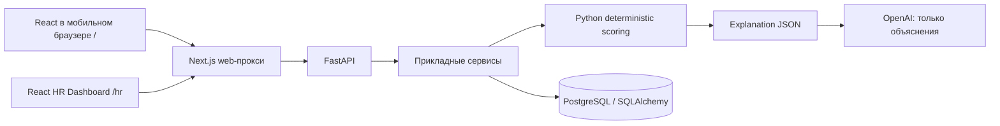

# Архитектура Career Quest

## Границы

Один репозиторий, React веб-приложение с экранами сотрудника и HR и модульный FastAPI backend. PostgreSQL — единый источник
сохраняемых данных. Нет микросервисов, Kubernetes, vector DB, ML/RAG.

Диаграмма показывает целевую архитектуру. В каркасе доступны system-endpoint'ы,
соединение с БД, расчёт навыков и интерфейсы. Frontend подготовлен к серверному сценарию: профиль, траектория, рекомендации, completion, HR и импорт.
Вход, профиль, навыки и история подключены к текущим read-контрактам. Остальные
бизнес-API ещё отсутствуют; интеграционный контракт и ограничения: [frontend-api](frontend-api.md).

## Backend

- `api`: маршруты и внешние Pydantic-контракты. Не содержит scoring и SQL.
- `application`: транзакционный импорт датасета, его Pydantic-контракты и Protocol-интерфейсы. Координирует БД,
  чистую доменную логику и провайдер объяснений.
- `domain`: dataclass-контракты и чистые функции, без FastAPI, SQLAlchemy и сети.
- `infrastructure`: SQLAlchemy engine/session factory, ORM-модели и загрузчик JSON/CSV.
- `auth`: роли `employee` / `hr`; демо-вход выдаёт JWT; каждый бизнес-маршрут проверяет роль и принадлежность профиля.

SQLAlchemy engine создаётся в lifespan API и освобождается при остановке.
Синхронные DB-проверки выполняются в sync-маршруте FastAPI. Для будущих бизнес-операций
использовать отдельную session на запрос/операцию и явную транзакцию.
Alembic использует общую metadata; `0001_dataset` создаёт бизнес-таблицы.
Импорт запускается через CLI в отдельной транзакции с PostgreSQL advisory lock.
Правила восстановления навыков и повторного импорта: [backend-data](backend-data.md).

## Контракты

| Endpoint | Результат |
| --- | --- |
| `GET /api/v1/health` | `200 {"status":"ok","stage":"foundation"}`; не обращается к БД |
| `GET /api/v1/ready` | `200 {"status":"ready","database":"ok"}` после `SELECT 1` |
| `GET /api/v1/ready`, ошибка БД | `503 {"status":"unavailable","database":"unavailable"}` без деталей соединения |

Web-прокси пропускает system- и разрешённые бизнес-маршруты, передаёт Bearer JWT
из HttpOnly cookie, проверяет Origin для POST. При сетевой ошибке возвращает 503.
Проверка ролей и принадлежности данных остаётся на backend. Адрес API берётся из серверного `API_URL`
во время выполнения, поэтому образ не привязан к адресу backend при сборке.

## Рекомендации и языки

`RecommendationEngine.rank(RecommendationContext)` возвращает упорядоченные
`RankedRecommendation`: event_id, score, target_grade, skill_gaps, expected_gains,
reason_codes. Выбор и баллы определяет только Python. Формулу и tie-break правила
зафиксируем по ТЗ до реализации scoring.

`ExplanationProvider.explain(ExplanationContext)` получает уже выбранные факты
и язык, возвращает тексты по event_id. Сервис должен проверить IDs и присоединить
тексты к исходным фактам. Ответ LLM не может менять выбор, score или рост навыков.
В OpenAI не требуется отправлять личность сотрудника. Сетевого адаптера пока нет.
При реализации нужен шаблонный fallback, чтобы сбой LLM не ломал рекомендации.

Языковые коды: `ru`, `kk`, `en`; обозначению KZ в продукте соответствует `kk` в контрактах.
Стартовые экраны пока на русском.

Расчёт навыков сохраняет исходные данные, ограничивает рост gain/max_level и шкалой 0–5,
не уменьшает уже достигнутый уровень. Неизвестные навыки и дубли эффектов отклоняются.
Повторное завершение активности должен предотвращать будущий транзакционный сервис.

## Запуск и дальнейший доступ

Compose поднимает БД → API → web с healthcheck-зависимостями. Сотрудник открывает / в браузере телефона, HR — /hr. Web слушает порт 3000 в локальной сети; API и БД остаются на localhost. Отдельного native-клиента нет.
База хранится в volume. Healthchecks после старта показывают состояние, но сами не
перезапускают зависимые сервисы. Клиенты показывают недоступность вместо бесконечного ожидания.

Демо-вход выдаёт JWT с серверной ролью employee/hr; по умолчанию выключен.
Сотрудник выбирает профиль, HR вводит серверный демо-пароль. [Контракты](backend-auth.md). Роль и доступ проверяются
backend для каждого бизнес-endpoint; выбор роли в интерфейсе не является авторизацией.
Секреты JWT/OpenAI хранятся только на backend. Развёртывание на Render/Railway/VPS —
отдельный этап; текущий Compose предназначен для локальной разработки и demo.

Референсы: [Next.js](https://nextjs.org/docs/app/getting-started/installation),
[React](https://react.dev/).
